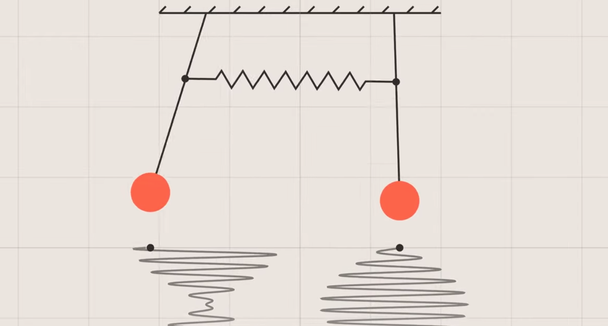

## Modern Introductory Physics Part II &mdash; Daily Schedule Term 4

Course [home page](./)

### Week 1 &mdash; Waves &mdash; Principle of Superposition

* Tuesday, Jan. 9 &mdash; Study *Six Ideas* Q1.1 to Q1.3 &mdash; Choose a problem to present from the end of Chapter Q1 and pair up with someone to discuss both problems and then present one of your two problems jointly &mdash; Study and complete the handout/worksheet on compression waves that I set out across from the copier
* Friday, Jan. 12 &mdash; Finish *Six Ideas* Q1 &mdash; Finish "The Bridge" handout &mdash; Look ahead to *Six Ideas* Q2 Section 1 &mdash; Problem Set 1 [Due Friday](./assignments/AssignmentFor2024-01-12.nb.pdf)

### Week 2 &mdash; Standing Waves &mdash; Interference

DELAYED: Enough people are out sick at the moment that I think it is best if we delay Problem Set 2 to Tuesday! Use the extra time to do a great job on your weakly coupled harmonic oscillator presentations. Make handouts to distribute to the people who can't attend. Meanwhile, I will prepare some more material on torsion waves. It isn't essential, but it is valuable. If you are curious about what a torsion wave is, here is a [torsion wave video](https://youtu.be/MrZcMTLK6W4)

* Tuesday, Jan. 16 &mdash; Presentations on weakly coupled harmonic oscillator &mdash; Torsion waves &mdash; Resonance
* Friday, Jan. 19 &mdash; Six Ideas Q2 &mdash; Problem Set 2 [Now due Friday](./assignments/AssignmentFor2024-01-16.nb.pdf)

### Week 3 &mdash; Interference &mdash; Light is a Particle

* Tuesday, Jan. 23 &mdash; Six Ideas Q3
* Friday, Jan. 26 &mdash; Six Ideas Q4

### Week 4 &mdash; Particles Behave Like Waves &mdash; Exam 1

* Tuesday, Jan. 30 &mdash; Six Ideas Q5
* Friday, Feb. 2 &mdash; Exam 1

### Week 5 &mdash;

* Tuesday, Feb. 6 &mdash;
* Friday, Feb. 9 &mdash;

### Week 6 &mdash;

* Tuesday, Feb. 13 &mdash;
* Friday, Feb. 16 &mdash;

### Week 7 &mdash; Exam 2

* Tuesday, Feb. 20 &mdash; Exam 2
