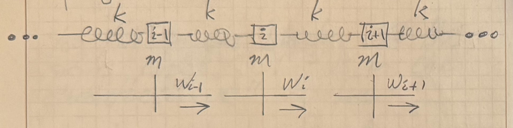

## Modern Introductory Physics Part II &mdash; Daily Schedule Term 4

Course [home page](./)

### Week 1 &mdash; Waves

* Preparation for first class &mdash; Read Sections Q1.1-Q1.3 of *Six Ideas* Unit Q (to p. 11) &mdash; Choose a problem to present from Chapter Q1 and pair up with someone to polish one of your problems &mdash; Do handout/worksheet on waves across from copier

