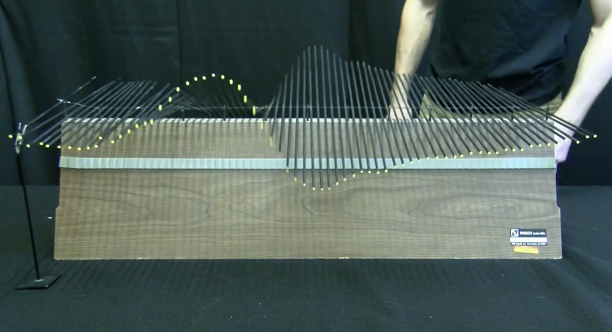

## Modern Introductory Physics Part II &mdash; Daily Schedule Term 4

Course [home page](./)

### Week 1 &mdash; Waves &mdash; Principle of Superposition

* Tuesday, Jan. 9 &mdash; Study *Six Ideas* Q1.1 to Q1.3 &mdash; Choose a problem to present from the end of Chapter Q1 and pair up with someone to discuss both problems and then present one of your two problems jointly &mdash; Study and complete the handout/worksheet on compression waves that I set out across from the copier
* Friday, Jan. 12 &mdash; Finish *Six Ideas* Q1 &mdash; Finish "The Bridge" handout &mdash; Look ahead to *Six Ideas* Q2 Section 1 &mdash; Problem Set 1 [Due Friday](./assignments/AssignmentFor2024-01-12.nb.pdf)

### Week 2 &mdash; Standing Waves &mdash; Interference

* Tuesday, Jan. 16 &mdash; Theory and simulation presentations for the [weakly coupled harmonic oscillator](./resources/WeaklyCoupledAnimation.nb.pdf) &mdash; Torsion wave theory, [torsion wave video](https://youtu.be/MrZcMTLK6W4), and [torsion wave animation](./resources/TorsionWaveAnimation.nb.pdf)
* Friday, Jan. 19 &mdash; Six Ideas Q2.1 to Q2.3 &mdash; [New presentations and Problem Set 2](./assignments/AssignmentFor2024-01-19.nb.pdf) for Friday

### Week 3 &mdash; Interference &mdash; Light is a Particle

* Tuesday, Jan. 23 &mdash; Six Ideas Q3
* Friday, Jan. 26 &mdash; Six Ideas Q4

### Week 4 &mdash; Particles Behave Like Waves &mdash; Exam 1

* Tuesday, Jan. 30 &mdash; Six Ideas Q5
* Friday, Feb. 2 &mdash; Exam 1

### Week 5 &mdash;

* Tuesday, Feb. 6 &mdash;
* Friday, Feb. 9 &mdash;

### Week 6 &mdash;

* Tuesday, Feb. 13 &mdash;
* Friday, Feb. 16 &mdash;

### Week 7 &mdash; Exam 2

* Tuesday, Feb. 20 &mdash; Exam 2
