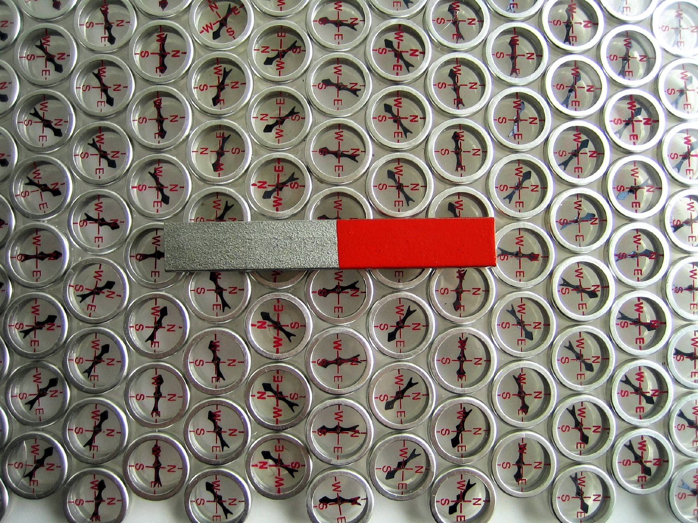
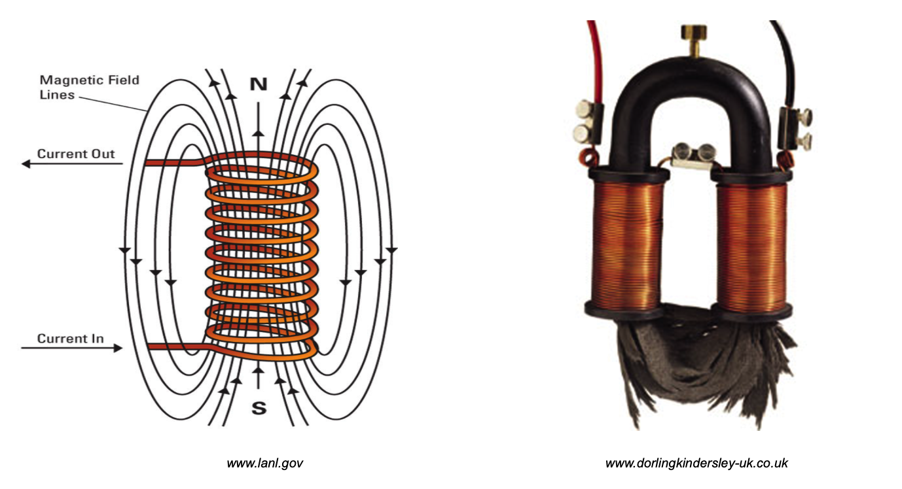

## Modern Introductory Physics Part II &mdash; Daily Schedule Term 4

Course [home page](./)

### Week 1 &mdash; Waves &mdash; Principle of Superposition

* Tuesday, Jan. 9 &mdash; Study *Six Ideas* Q1.1 to Q1.3 &mdash; Choose a problem to present from the end of Chapter Q1 and pair up with someone to discuss both problems and then present one of your two problems jointly &mdash; Study and complete the handout/worksheet on compression waves that I set out across from the copier
* Friday, Jan. 12 &mdash; Finish *Six Ideas* Q1 &mdash; Finish "The Bridge" handout &mdash; Look ahead to *Six Ideas* Q2 Section 1 &mdash; Problem Set 1 [Due Friday](./assignments/AssignmentFor2024-01-12.nb.pdf)

### Week 2 &mdash; Standing Waves &mdash; Interference

* Tuesday, Jan. 16 &mdash; Theory and simulation presentations for the [weakly coupled harmonic oscillator](./resources/WeaklyCoupledAnimation.nb.pdf) &mdash; Torsion wave theory, [torsion wave video](https://youtu.be/MrZcMTLK6W4), and [torsion wave animation](./resources/TorsionWaveAnimation.nb.pdf)
* Friday, Jan. 19 &mdash; Study Six Ideas Sections Q2.1 to Q2.3 &mdash; Discussion of Problem Set 2, especially harmonics on a guitar string and modes of an organ pipe &mdash; Presentation from Group 1 on [Single-Slit interference](https://youtu.be/Haa1a58k8kg) &mdash; Presentation from Group 2 on [Double-Slit interference](https://youtu.be/egRFqSKFmWQ) &mdash; [Problem Set 2](./assignments/AssignmentFor2024-01-19.nb.pdf) for Friday

### Week 3 &mdash; Interference &mdash; Light is a Particle

* Tuesday, Jan. 23 &mdash; Study Six Ideas Sections Q3.1 to Q3.5 (Q3.6 is advanced) &mdash; Advanced discussion of last problem on Problem Set 3 &mdash; Presentation from Ethan (with Hexi and Miles if out of quarantine): a Python program that does the in-class exercise from the last class &mdash; Presentation from Emma on applications of Section Q3.6 to laboratory class on cloning &mdash; Presentation from Brian (looking ahead to Q4.1): [Light is a wave](./resources/LightIsAWave.nb.pdf) and the wave theory explains the entire electromagnetic spectrum &mdash; Presentation from Trey: the ultraviolet catastrophe vs. the actual black-body radiation spectrum &mdash; [Problem Set 3](./assignments/AssignmentFor2024-01-23.nb.pdf) for Tuesday
* Friday, Jan. 26 &mdash; Six Ideas Q4 &mdash; Presentation from Miles on the rare condition of tetrachromacy &mdash; Presentations from Rebecca and Hexi (who will coordinate and divide the historical material): Evidence for the wave nature of light such as the explanation of Snell's Law vs. evidence for its particle nature, especially Millikan's paper from 1913 &mdash; Presentation from Ren and Miles: Problem Q4R.1 on the visibility of stars &mdash; Presentation from Brian: Prelude to [&ldquo;Particles Behave Like Waves,&rdquo;](./resources/WaveParticleDuality.nb.pdf) Chapter Q5 &mdash; [Problem Set 4](./assignments/AssignmentFor2024-01-26.nb.pdf)

### Week 4 &mdash; Particles Behave Like Waves &mdash; Exam 1

* Tuesday, Jan. 30 &mdash; Six Ideas Q5 &mdash; Black-body radiation and the resulting appearance of [bluish stars, white and yellowish stars, and reddish stars](./resources/BlackBodyRadiationII.png) &mdash; Presentations on Q1 to Q4: Emma and Ethan, Q1R.1, a slightly tricky Doppler shift problem; Hexi and Miles, Q2R.2, pulsation frequency of variable stars; Rebecca and Ren, Q3R.1, passing by foghorns; Trey, the energy levels and photon spectrum of hydrogen &mdash; [Problem Set 5](./assignments/AssignmentFor2024-01-30.nb.pdf) for Tuesday &mdash; Discussion of interference patterns in the first problem of Problem Set 5 &mdash; A look ahead at Q6, spin, beginning with a comparison of the units of angular momentum with the units of *h*
* Friday, Feb. 2 &mdash; [Exam 1](./exams/Exam1.nb.pdf)

### Week 5 &mdash; Spin and Complex Variables

* Tuesday, Feb. 6 &mdash; We will start into both Q6 and complex variables &mdash; Study Sections Q6.1, Q6.2 and Q6.3 of Moore &mdash; Study Sections 1-4 of Churchill, Brown, and Verhey, *Complex Variables and Applications* &mdash; Presentation from Emma, how the Balmer, Lyman, and Paschen wavelengths from Hydrogen were observed and cataloged &mdash; [Problem Set 6](./assignments/AssignmentFor2024-02-06.nb.pdf) for Tuesday &mdash; Lecture and handout on [Spin Angular Momentum and Magnetic Moment of the Electron](./resources/AngularMomentumAndMagneticMoment.nb.pdf)
* Friday, Feb. 9 &mdash; Finish studying Chapter Q6 of Moore &mdash; Study Sections 5 and 6 of Churchill, Brown, and Verhey &mdash; [Problem Set 7](./assignments/AssignmentFor2024-02-09.nb.pdf) for Friday &mdash; Presentation ideas: (1) Angular momentum, torque, and precession; the relevant material was Volume C, Chapter C6 of *Six Ideas;* (2) Magnetism, electromagnets, and the magnetic field in the Stern-Gerlach apparatus; the relevant material is Section Q6.3, perhaps [a photo like this one by Dana Mason](./resources/MagneticField.jpeg), plus illustrations and examples like [this material](./resources/BE-Ch12-MagneticCircuits.pdf) from a Nanhua University course; (3) I will say a little more about magnetic moments and then do a look ahead to Chapter Q7; (4) We could close with a look even farther ahead to Section Q8.4, Schrödinger's Cat; this is advanced stuff, and in fact, Moore has marked Q8 as optional

### Week 6 &mdash;

* Tuesday, Feb. 13 &mdash;
* Friday, Feb. 16 &mdash;

### Week 7 &mdash; Exam 2

* Tuesday, Feb. 20 &mdash; Exam 2

Photo by [Dana Mason on flickr.com](https://www.flickr.com/photos/daynoir/2180507211/)

