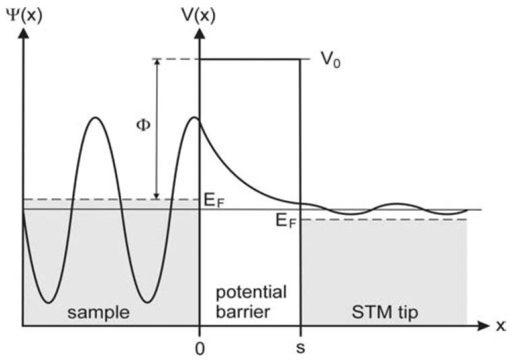

## Modern Introductory Physics Part II &mdash; Daily Schedule Term 5

Course [home page](./)

See also [Daily Schedule-Term 4](./daily_schedule-term_4.html)

### Week 8 &mdash; Continue Wave Functions

* Tuesday, Mar. 12 &mdash; Finish Q9 and start Q10 &mdash; Study Moore through p. 154 &mdash; *Sx&thinsp;*, *Sy&thinsp;*, and *Sz* cannot be simultaneously specified &mdash; Position and momentum cannot be simultaneously specified! &mdash; The momentum operator in position space (one of the brilliant leaps of de Broglie and Schr&ouml;dinger) &mdash; Review of a couple super-useful integral calculus techniques: changes of variables in integrals (nowadays, people are calling this &ldquo;*u*-substitution&rdquo;) and integration by parts &mdash; The [Heisenberg Uncertainty Principle](./resources/HeisenbergUncertaintyPrinciple.nb.pdf) (a long and important supplement that rigorously states what Moore only briefly states in Section Q9.4) &mdash; [Problem Set 10](./assignments/AssignmentFor2024-03-12.nb.pdf) for Tuesday
* Friday, Mar. 15 &mdash; Finish Q10 (except save Q10.4 until Tuesday, Mar. 19) &mdash; Presentations: Brian, The time-independent [Schr&ouml;dinger Equation](./resources/SchrodingerEquation.nb.pdf); Hexi, Ethan, and Miles, Building a simple oscillator out of the [0th and 1st harmonic oscillator wave functions](./resources/HarmonicOscillator.nb.pdf) introduced in Section Q10.5; Emma and Trey, The fundamental quantum mechanics behind [lasers](./resources/Lasers.nb.pdf) &mdash; Course [feedback](./resources/Feedback.png) discussion &mdash; Debate and decision of what we will do in weeks 11-14 (it was decided that we will do more quantum mechanics and nuclear physics, rather than switching to special relativity) &mdash; [Problem Set 11](./assignments/AssignmentFor2024-03-15.nb.pdf) for Friday

### Week 9 &mdash; The Hydrogen Atom, Atomic Spectra, and the Schr&ouml;dinger Equation

* Tuesday, Mar. 19 &mdash; Q10.4 and Q11.1 to Q11.5 &mdash; Presentations: Brian, The 3-D Schr&ouml;dinger Equation; Ren and Rebecca, Using the Pauli Exclusion Principle to discover the energy of a [Fermion Gas](./resources/FermionGas.nb.pdf) (ignoring Coulomb repulsion) &mdash; [Problem Set 12](./assignments/AssignmentFor2024-03-19.nb.pdf) for Tuesday
* Friday, Mar. 22 &mdash; Study Q11.6 and Q12.1 to Q12 &mdash; [Problem Set 13](./assignments/AssignmentFor2024-03-22.nb.pdf) for Friday &mdash; Presentations: Emma, Applying the ideas of Example 11.1 to other molecules (caffeine?!); Brian, Continuation of the quantum tunneling ideas started in Problem Set 13

#### Schematic Wave Function for a Scanning Tunneling Microscope (STM)

### Week 10 &mdash; Continue the Schr&ouml;dinger Equation &mdash; Exam 3

* Tuesday, Mar. 26 &mdash; Continue in Q12 
* Friday, Mar. 29 &mdash; Exam 3 covering Problem Sets 10-14 and Moore Chapters Q10, Q11, and Q12

### Week 11 &mdash; Numerical Methods for Solving Schr&ouml;dinger's Equation &mdash; The Dawn of Nuclear Physics

* Tuesday, Apr. 2 &mdash; Finish Q12
* Friday, Apr. 5 &mdash; The Dawn of Nuclear Physics, the discovery of alpha-particles, beta-particles, gamma-particles, and the neutron

### Week 12 &mdash;

* Tuesday, Apr. 9 &mdash;
* Friday, Apr. 12 &mdash;

### Week 13 &mdash;

* Tuesday, Apr. 16 &mdash;
* Friday, Apr. 19 &mdash;

### Week 14 &mdash; Exam 4 &mdash; Final Topic

* Tuesday, Apr. 23 &mdash; Exam 4
* Friday, Apr. 26 &mdash; A Final Blow-Off Top Topic: Nuclear Magnetic Resonance, aka Magnetic Resonance Imaging (MRI)? The Feynman Path Integral? The Cosmic Speed Limit and the Proof of Time Dilation?