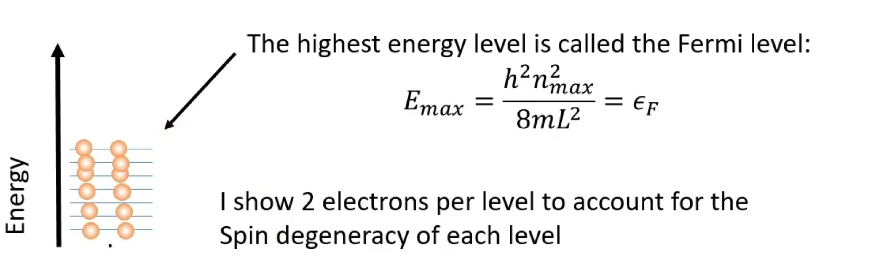

## Modern Introductory Physics Part II &mdash; Daily Schedule Term 5

Course [home page](./)

See also [Daily Schedule-Term 4](./daily_schedule-term_4.html)

*A TENTATIVE OUTLINE FOLLOWS. THERE IS A FORK IN THE ROAD AT THE BEGINNING OF APRIL*

### Week 8 &mdash; Continue Wave Functions

* Tuesday, Mar. 12 &mdash; Finish Q9 and start Q10 &mdash; Study Moore through p. 154 &mdash; *Sx&thinsp;*, *Sy&thinsp;*, and *Sz* cannot be simultaneously specified &mdash; Position and momentum cannot be simultaneously specified! &mdash; The momentum operator in position space (one of the brilliant leaps of de Broglie and Schr&ouml;dinger) &mdash; Review of a couple super-useful integral calculus techniques: changes of variables in integrals (nowadays, people are calling this &ldquo;*u*-substitution&rdquo;) and integration by parts &mdash; The [Heisenberg Uncertainty Principle](./resources/HeisenbergUncertaintyPrinciple.nb.pdf) (a long and important supplement that rigorously states what Moore only briefly states in Section Q9.4) &mdash; [Problem Set 10](./assignments/AssignmentFor2024-03-12.nb.pdf) for Tuesday
* Friday, Mar. 15 &mdash; Finish Q10 (except save Q10.4 until Tuesday, Mar. 19) &mdash; Presentations for Friday: Hexi, Ethan, and Miles, building a simple oscillator out of the [0th and 1st harmonic oscillator wave functions](./resources/HarmonicOscillator.nb.pdf) introduced in Section Q10.5; Emma and Trey, the fundamental quantum mechanics behind lasers; Ren and Rebecca (looking ahead to Section 11.5), using The Pauli Exclusion Principle to discover how much energy it requires to stuff *2N* electrons in a box, even ignoring Coulomb repulsion (these are all advanced topics, so please budget time to work with me to make high-quality presentations that will really help your classmates) &mdash; Debate and decision of what we will do in weeks 11-14 (more quantum mechanics followed by nuclear physics, or switch to relativity?) &mdash; [Problem Set 11](./assignments/AssignmentFor2024-03-15.nb.pdf) for Friday

### Week 9 &mdash; The Hydrogen Atom, Atomic Spectra, and the Schr&ouml;dinger Equation

* Tuesday, Mar. 19 &mdash; Q10.4, Q11
* Friday, Mar. 22 &mdash; Start Q12

### Week 10 &mdash; Last Class on Quantum Mechanics? &mdash; Exam 3

* Tuesday, Mar. 26 &mdash; Do as much as we can of Q12
* Friday, Mar. 29 &mdash; Exam 3 covering Problem Sets 10-14 and Moore Chapters Q10, Q11, and Q12

### Week 11 &mdash; Leave Quantum Mechanics and Start Relativity?

* Tuesday, Apr. 2 &mdash; R1 or continue in Q12 and Q13
* Friday, Apr. 5 &mdash; R2

### Week 12 &mdash;

* Tuesday, Apr. 9 &mdash; R3
* Friday, Apr. 12 &mdash; R4

### Week 13 &mdash;

* Tuesday, Apr. 16 &mdash; R5
* Friday, Apr. 19 &mdash; R6

### Week 14 &mdash; Exam 4 &mdash; Final Topic

* Tuesday, Apr. 23 &mdash; Exam 4
* Friday, Apr. 26 &mdash; A Final Blow-Off Top Topic: Nuclear Magnetic Resonance, aka Magnetic Resonance Imaging? R7.1 The Cosmic Speed Limit? The Feynman Path Integral?