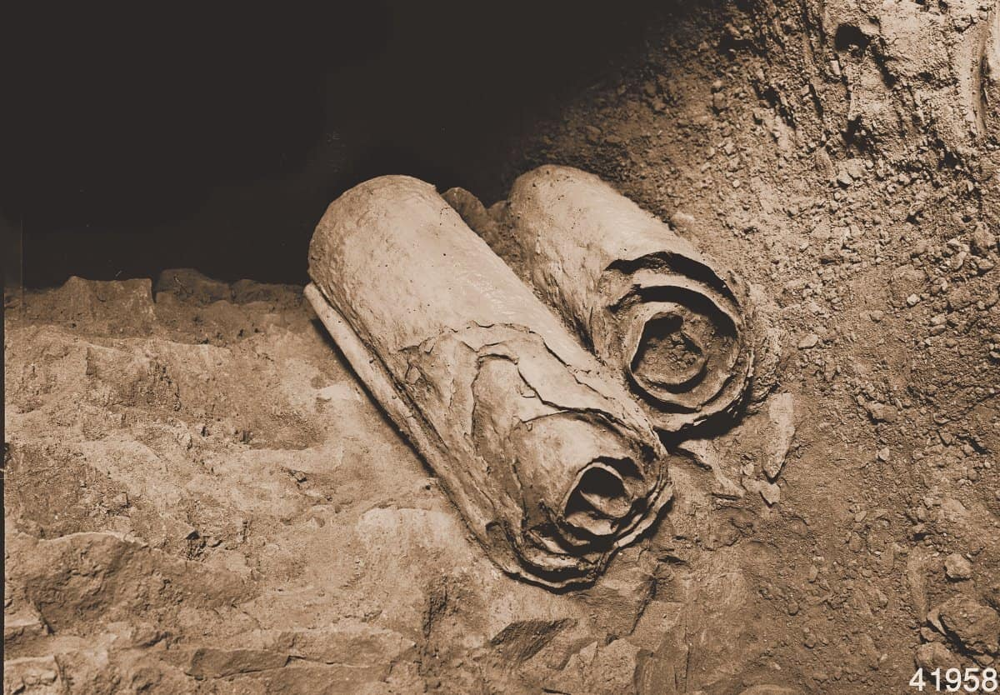

## Modern Introductory Physics Part II &mdash; Daily Schedule Term 5

Course [home page](./)

See also [Daily Schedule-Term 4](./daily_schedule-term_4.html)

### Week 8 &mdash; Continue Wave Functions

* Tuesday, Mar. 12 &mdash; Finish Q9 and start Q10 &mdash; Study Moore through p. 154 &mdash; *Sx&thinsp;*, *Sy&thinsp;*, and *Sz* cannot be simultaneously specified &mdash; Position and momentum cannot be simultaneously specified! &mdash; The momentum operator in position space (one of the brilliant leaps of de Broglie and Schr&ouml;dinger) &mdash; Review of a couple super-useful integral calculus techniques: changes of variables in integrals (nowadays, people are calling this &ldquo;*u*-substitution&rdquo;) and integration by parts &mdash; The [Heisenberg Uncertainty Principle](./resources/HeisenbergUncertaintyPrinciple.nb.pdf) (a long and important supplement that rigorously states what Moore only briefly states in Section Q9.4) &mdash; [Problem Set 10](./assignments/AssignmentFor2024-03-12.nb.pdf) for Tuesday
* Friday, Mar. 15 &mdash; Finish Q10 (except save Q10.4 until Tuesday, Mar. 19) &mdash; Presentations: Brian, The time-independent [Schr&ouml;dinger Equation](./resources/SchrodingerEquation.nb.pdf); Hexi, Ethan, and Miles, Building a simple oscillator out of the [0th and 1st harmonic oscillator wave functions](./resources/HarmonicOscillator.nb.pdf) introduced in Section Q10.5; Emma and Trey, The fundamental quantum mechanics behind [lasers](./resources/Lasers.nb.pdf) &mdash; Course [feedback](./resources/Feedback.png) discussion &mdash; Debate and decision of what we will do in weeks 11-14 (it was decided that we will do more quantum mechanics and nuclear physics, rather than switching to special relativity) &mdash; [Problem Set 11](./assignments/AssignmentFor2024-03-15.nb.pdf) for Friday

### Week 9 &mdash; Observed Properties of the Hydrogen Atom, Atomic Spectra, and the Schr&ouml;dinger Equation

* Tuesday, Mar. 19 &mdash; Q10.4 and Q11.1 to Q11.5 &mdash; Presentations: Brian, The 3-D Schr&ouml;dinger Equation; Ren and Rebecca, Using the Pauli Exclusion Principle to discover the energy of a [Fermion Gas](./resources/FermionGas.nb.pdf) (ignoring Coulomb repulsion) &mdash; [Problem Set 12](./assignments/AssignmentFor2024-03-19.nb.pdf) for Tuesday
* Friday, Mar. 22 &mdash; Study Q11.6 and Q12.1 to Q12 &mdash; [Problem Set 13](./assignments/AssignmentFor2024-03-22.nb.pdf) for Friday &mdash; Presentations: Emma, Applying the ideas of Example 11.1 to other molecules (caffeine?!); Brian, Continuation of the quantum tunneling ideas started in Problem Set 13

### Week 10 &mdash; Continue Schr&ouml;dinger Equation Examples &mdash; Exam 3

* Tuesday, Mar. 26 &mdash; No new reading or problem set &mdash; In-class, we will analyze the [particle in a finitely-deep potential well](./resources/ParticleInAPotentialWell.nb.pdf), and [the raising and lowering operators for the harmonic oscillator](./resources/HarmonicOscillatorRaisingAndLowering.nb.pdf) (my writeup is a small taste of [operator methods](./HarmonicOscillatorSolutionUsingOperators.pdf) that are used a lot in quantum field theory because free field theories, including quantum electrodynamics (QED) in the absence of any charges, can be analyzed using the same raising and lowering operator methods as are used for the harmonic oscillator)
* Friday, Mar. 29 &mdash; [Exam 3](./exams/Exam3.nb.pdf) covering Problem Sets 10-13 and Moore Chapters Q10, Q11, and Q12 (through Q12.3)

### Week 11 &mdash; Numerical Methods for Solving Schr&ouml;dinger's Equation &mdash; Theory of the Hydrogen Atom &mdash; Spherical Harmonics &mdash; The Dawn of Nuclear Physics, 1896-1911

* Tuesday, Apr. 2 &mdash; Finish Q12 &mdash; [Problem Set 14](./assignments/AssignmentFor2024-04-02.nb.pdf) &mdash; Discussion of 12.6 and 12.7, qualitative graphical solutions of Schrödinger's equation and the application of qualitative methods to ramp and barrier wave functions &mdash; The [two-dimensional and three-dimensional rotationally-symmetric potential](./resources/TwoAndThreeDimensionalPotentialWells.nb.pdf), which is especially important for understanding hydrogen, and also a gateway to being able to converse with chemists who often think in terms of probability densities and electron clouds &mdash; [Another, possibly or even probably, better write-up of the what I wrote up](https://tinyurl.com/libretextshydrogen), see especially the state-naming conventions at the end which need to be second nature if you want to be able to converse with chemists &mdash; In a year-long, junior-level quantum mechanics course, you would spend lots more time studying these solutions &mdash; In our semester-long, sophomore-level course, we are being quite ambitious to have even discussed them at all
* Friday, Apr. 5 &mdash; [Nuclear Physics from 1896-1911](./resources/EarlyNuclearHistory.pages.pdf), the discovery of radioactivity, exponential decay and the nucleus following pp. 19-40 of Reed &mdash; Please jump on the historical reading because I would like three groups of two people to springboard from that into class presentations for Friday &mdash; Start Q13: Sections Q13.1, Q13.2 and Q13.6 &mdash; [Problem Set 15](./assignments/AssignmentFor2024-04-05.nb.pdf) 

### Week 12 &mdash; Nuclear Physics

* Tuesday, Apr. 9 &mdash; Finish your study of Q13 &mdash; Presentations: (1) Brian will present the relativistic kinematics that forced the hypothesis of the neutron; (2) We had a five-part presentation on mass spectrometry! &mdash; We looked ahead to Section 14.1 and discussed how neutron decay is understood in terms of quarks &mdash; [Problem Set 16](./assignments/AssignmentFor2024-04-09.nb.pdf) 
* Friday, Apr. 12 &mdash; Study Q14 &mdash; The reasonging behind the mass-deficit formulae &mdash; The traditional definition of the amu (atomic mass unit) &mdash; The traditional definitions of the meter and the kilogram (the distance from the north pole to the equator on a line passing through Paris as 10,000,000 meters was the first definition of the meter) &mdash; The modern definitions of [SI Units](./resources/SIUnits.pdf) and especially of the gram in terms of Avogadro's number and Carbon-12, which is now defined to have an amu of 12.0000 &mdash; Reading decay-chain diagrams (e.g. those in Moore in Fig. Q14.15, p. 237)  &mdash; Why are &beta; decays so slow &mdash; Why is an &alpha;-particle emission a decay mode? &mdash; How is fission induced? &mdash; [Problem Set 17](./assignments/AssignmentFor2024-04-12.nb.pdf)

### Week 13 &mdash; Nuclear Physics Applications

* Tuesday, Apr. 16 &mdash; Study Q15 &mdash; Presentation by Miles (maybe someone wants to join him!?): How are atoms or electrons or ions counted so as to make 1 mole (abbreviated mol), *in practice*; and in particular, how is the gram which is now defined as 1/12 of the mass of an Avogadro's number (602,214,076,000,000,000,000,000) of Carbon-12 atoms counted, *in practice* &mdash; [Problem Set 18](./assignments/AssignmentFor2024-04-16.nb.pdf) &mdash; Choose the two remaining special topics

#### Some of the scrolls found near Qumran, between late 1946 and 1956

* Friday, Apr. 19 &mdash; Special Topic 1 (your choice, such as an atomic or nuclear physics phenomenon like MRI?)

### Week 14 &mdash; Exam 4 &mdash; Final Topic

* Tuesday, Apr. 23 &mdash; Exam 4 Covering Problem Sets 14-18 (Moore Q12.5 to end of Q15)
* Friday, Apr. 26 &mdash; Special Topic 2 (your choice, such as an introduction to special relativity focusing on time dilation or an introdution to the Feynman path integral)
